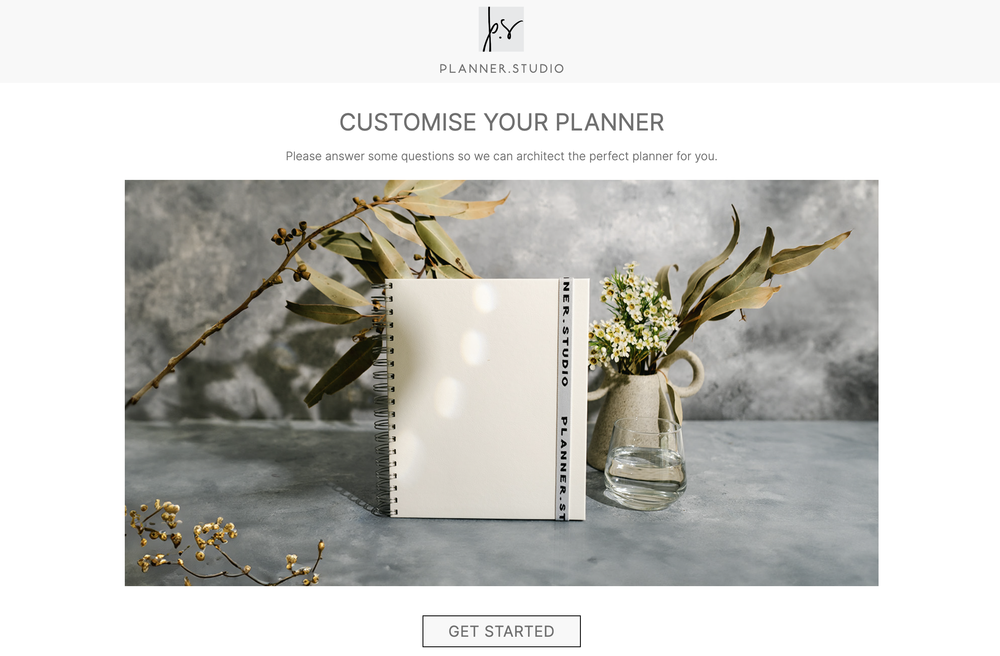

# Planner Design App

## Badges

## Description
A tool allowing users to design and download a pdf planner. The planner is customised by selecting a date range and choosing from a selection of page layouts

## Table of Contents
- [Screenshot](#screenshot-of-website)
- [License](#license)
- [Questions](#questions)

## Screenshot of website

## License
All assets and code are under GNU GPLv3 unless specified otherwise.

## Questions
Any questions? Visit my GitHub profile at [https://github.com/katyjmt](https://github.com/katyjmt) or email me at [katyjmt@gmail.com](katyjmt@gmail.com).